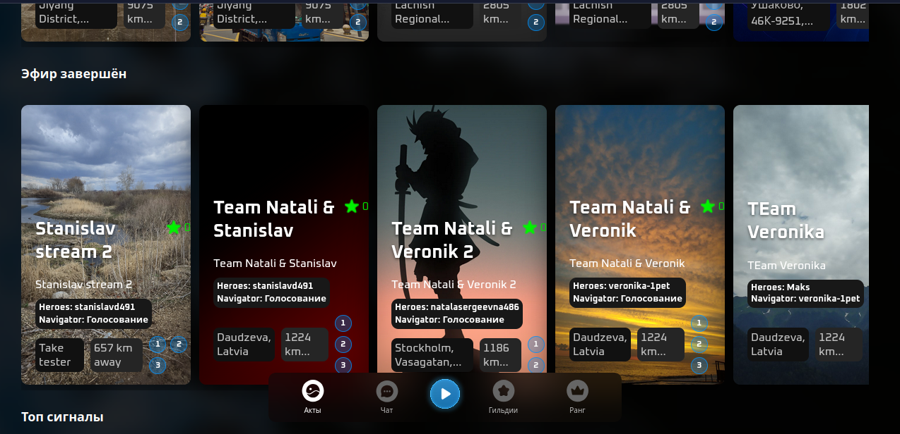

# 🎬 Meract

<p align="center">
  <a href="https://meract.com"><strong>meract.com</strong></a>
</p>

<p align="center">
  
  
  
  
</p>

---

## 📝 Project Description

**Meract** is a modern interactive streaming platform. The project combines live broadcasting, real-time chat communication, gamification elements (achievements, guilds), and unique geolocation-based route creation.

<p align="center">
  
</p>


---

## ⚡ Quick Start

### 📋 Prerequisites
* **Node.js** (version 16 or higher)
* A running and accessible **Backend API server**

### 📦 Installation
Install the project dependencies using your preferred package manager:

```bash
npm install
# or
yarn install
```

### ⚙️ Environment Configuration
Create a `.env` file in the root directory of the project and specify the required keys:

```env
VITE_API_URL=http://localhost:3000
VITE_AGORA_APP_ID=your_agora_app_id
```

### 🚀 Running the Development Server
Launch the project locally with hot-reload enabled:

```bash
npm run dev
# or
yarn dev
```
> The application will be accessible at: `http://localhost:5173`

### 🏗️ Production Build & Preview
Compile the optimized files for production and preview the build locally:

```bash
npm run build
npm run preview
```

---

## 🏗️ Project Architecture

### 🛠️ Tech Stack

* **UI Framework:** `React 19`
* **Build Tool & Dev Server:** `Vite`
* **Routing:** `React Router`
* **State Management:** `Zustand`
* **HTTP Client:** `Axios`
* **Real-time Communication:** `Socket.io`
* **Live Streaming:** `Agora SDK`
* **Maps & Geolocation:** `Leaflet`
* **Notifications:** `React Toastify`


### 📂 Folder Structure

```text
src/
├── assets/          # Static assets (images, fonts, icons)
├── components/      # Reusable UI components
├── hooks/           # Custom React hooks
├── pages/           # Page components (Streams, Map, Profile, Guilds)
├── routes/          # React Router configuration
├── services/        # API integrations (Axios, Socket, Agora)
├── stores/          # Zustand state management stores
└── main.jsx         # Application entry point
```
